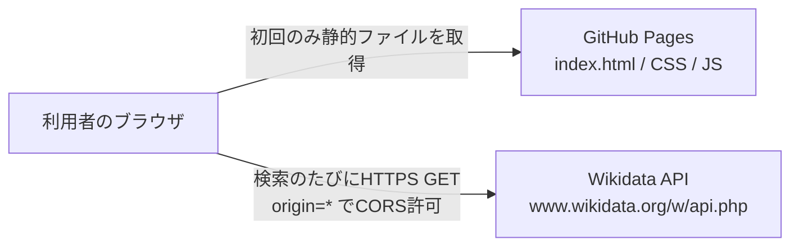

# 技術仕様書 (Architecture Design Document)

## 設計方針

**一番簡素な構成を選ぶ**。ビルドツール・フレームワーク・npmパッケージを使わず、ブラウザがそのまま読み込めるHTML / CSS / JavaScriptだけで作る。開発に必要なのは、devcontainerにすでに入っているNode.jsとPython 3の標準機能のみとする。

## テクノロジースタック

### 言語・ランタイム

| 技術 | バージョン | 用途 |
|------|-----------|------|
| HTML / CSS | HTML Living Standard | 画面の構造とスタイル |
| JavaScript | ES2022(ES Modules) | アプリケーションのロジック |
| Node.js | v24系(devcontainer同梱) | ユニットテストの実行のみ(組み込みテストランナー) |
| Python 3 | 3.11系(devcontainer同梱) | ローカル開発サーバーのみ(`http.server`) |

**選定理由**:
- **JavaScript(ES Modules)**
  - `<script type="module">` でブラウザがそのまま読み込めるため、ビルドが不要
  - `import` / `export` でファイルを分割でき、機能設計書のレイヤー分けをそのまま表現できる
  - 型はJSDocで記述し、エディタ(VS Code)の補完と型チェックの恩恵を受ける
- **TypeScriptを使わない理由**: ブラウザが直接実行できず、ビルド工程とnpmパッケージが必要になるため
- **Node.js(テストのみ)**: 組み込みの `node:test` と `node:assert` で、npmパッケージなしにユニットテストを実行できる。Node.js v24はES Modules構文を自動判別するため、`package.json` も不要
- **Python 3(開発サーバーのみ)**: ES Modulesは `file://` では読み込めないため、ローカル確認用のHTTPサーバーが必要。`python3 -m http.server` はインストール不要で使える

### フレームワーク・ライブラリ

使用しない。

| 検討した候補 | 採用しない理由 |
|------------|--------------|
| React / Vue などのUIフレームワーク | 1ページ・入力欄2つ・図1つの規模では、ビルドと依存関係の管理コストが利点を上回る |
| D3.js などの描画ライブラリ | 描くのは横線・目盛り・文字のみで、SVGを直接組み立てれば十分 |
| Wikidataのクライアントライブラリ | 使うAPIは2種類のGETリクエストのみで、`fetch` で十分 |
| 自作の偉人リスト(JSON)を同梱 | 確実で速いが、載せた人物しか調べられない。「好きな人物を選べる」というPRDの価値を満たせないため、Wikidataから取得する |

### 開発ツール

| 技術 | 用途 | 選定理由 |
|------|------|----------|
| `node --test` | ユニットテストの実行 | Node.js組み込み。インストール不要 |
| `python3 -m http.server` | ローカル開発サーバー | Python組み込み。インストール不要 |
| ブラウザの開発者ツール | 動作確認、通信エラーの再現、スマホ幅の表示確認 | 追加のツールが不要 |
| GitHub Pages | 公開 | 静的ファイルを置くだけで公開できる。ビルド工程なしでリポジトリのファイルをそのまま配信する |

リンター・フォーマッターは導入しない(npmパッケージが必要になるため)。コードの書き方は `docs/development-guidelines.md` の規約で統一する。

## アーキテクチャパターン

### レイヤードアーキテクチャ

```
┌─────────────────────────────────────────┐
│ UIレイヤー                                │ ← DOM・SVGの操作、利用者の操作の受付、状態管理
│  app.js / person-input.js /              │
│  timeline-view.js / result-view.js       │
├─────────────────────────────────────────┤
│ ロジックレイヤー                           │ ← 年の計算・表記、2人の比較(純粋な関数)
│  years.js / comparison.js /              │
│  timeline-scale.js                       │
├─────────────────────────────────────────┤
│ データレイヤー                             │ ← Wikidataからの取得とPersonへの変換
│  wikidata-client.js / person-parser.js   │
└─────────────────────────────────────────┘
```

#### UIレイヤー
- **責務**: DOM・SVGの描画、利用者の入力・選択の受付、画面の状態(AppState)の保持
- **許可される操作**: ロジックレイヤー・データレイヤーの関数の呼び出し
- **禁止される操作**: Wikidata APIへの直接の `fetch`、生没年の計算ロジックの実装

#### ロジックレイヤー
- **責務**: 年の変換・表記、重なり・年齢関係の計算
- **許可される操作**: ロジックレイヤー内の関数の呼び出し
- **禁止される操作**: DOMへのアクセス、通信、現在時刻の取得(`currentYear` は引数で受け取る)

#### データレイヤー
- **責務**: Wikidata APIの呼び出し、応答からPersonへの変換、条件に合わない人物の除外
- **許可される操作**: `fetch`、ロジックレイヤーの `years.js` の呼び出し
- **禁止される操作**: DOMへのアクセス、表示用の文章の組み立て

**依存の方向**: UI → データ → ロジック、UI → ロジック。逆向きの依存は禁止する。レイヤーの考え方は本書を正とし、ディレクトリ・ファイル単位の `import` のルールは `docs/repository-structure.md` の「依存関係のルール」で定める。

ロジックレイヤーと `person-parser.js` はDOMに依存しないため、Node.jsでそのままユニットテストできる。`wikidata-client.js` は `fetch` を使うが、Node.js v24にも `fetch` があるため、差し替え可能にしておけばテストできる。

### 実行時の構成



- 自前のサーバー・バックエンドは持たない
- WikidataのAPIは `origin=*` パラメータを付けると匿名のCORSリクエストを許可するため、ブラウザから直接呼び出せる

## データ永続化戦略

### ストレージ方式

| データ種別 | ストレージ | フォーマット | 理由 |
|-----------|----------|-------------|------|
| 選択中の人物(AppState) | メモリ(JavaScriptの変数)のみ | Personオブジェクト | PRDで保存・履歴をスコープ外としている |
| 人物データ | 保存しない(毎回Wikidataから取得) | - | データの正はWikidataとし、独自のデータベースを持たない |
| 比較の共有(P1) | URLのクエリパラメータ | `?a=Q171411&b=Q171977` | サーバーなしで共有できる |

`localStorage` や Cookie は使用しない。

### バックアップ戦略

利用者のデータを保存しないため、バックアップは不要。ソースコードはGitHubのリポジトリで管理する。

### 障害時の切り戻し

公開後に不具合が見つかった場合は、原因のコミットを `git revert` して `main` にpushする。GitHub Pagesが数分以内に再配信し、元の状態に戻る。

## パフォーマンス要件

### レスポンスタイム

| 操作 | 目標時間 | 測定環境 | 測定方法 |
|------|---------|---------|---------|
| 初回表示(入力可能になるまで) | 2秒以内 | スマホ、4G回線 | 開発者ツールのネットワーク制限「Fast 4G」でDOMContentLoadedまでの時間 |
| 候補の表示 | 入力停止から1秒以内 | スマホ、4G回線 | 開発者ツールのネットワークタブで、デバウンス0.3秒+API 2回の合計時間 |
| タイムライン・結果の描画 | 候補選択から0.5秒以内 | スマホ | `performance.now()` で選択から描画完了までを計測 |

### 転送量

| 対象 | 上限 | 理由 | 測定方法 |
|------|------|------|---------|
| 静的ファイルの合計(HTML / CSS / JS) | 100KB以内(非圧縮) | 4G回線で2秒以内に表示するため。ライブラリを使わないので十分に収まる | 開発者ツールのネットワークタブで「キャッシュを無効化」にして再読み込みし、Wikidata以外のリソースのサイズを合計する |
| 1回の検索での通信 | 2リクエスト | 候補検索1回+詳細取得1回(機能設計書のUC1・API設計) | 開発者ツールのネットワークタブで、1回の入力に対するWikidataへのリクエスト数を数える |

### 実現方法
- ビルドなしでも読み込みが速いよう、JavaScriptファイルは機能設計書の9ファイル程度に留める
- `wbgetentities` の `props` を `labels|descriptions|claims`、`languages` を `ja|mul|en` に絞り、不要なデータを取得しない
- 古い検索は `AbortController` で中断し、無駄な通信と描画をしない

## セキュリティアーキテクチャ

### データ保護

- **監視・ログ収集**: 行わない。アクセス解析やエラーログの送信をしないため、障害の把握は開発者自身の確認と利用者からの報告に頼る
- **個人情報**: 扱わない。ログイン・保存・アクセス解析を行わない
- **機密情報**: APIキーは不要(Wikidataは匿名で利用できる)。リポジトリに秘密情報を置かない
- **通信**: HTTPSのみ(GitHub Pages、Wikidataともに)

### 入力検証

- **検索語**: 前後の空白を除去し、空なら検索しない。長さは100文字で切り詰める。`URLSearchParams` でエンコードしてURLに入れる
- **Wikidataの応答**: 想定した構造かを確認してから使う。欠けている項目は「データなし」として扱い、例外で画面を壊さない
- **URLのID(P1)**: `^Q\d+$` に一致するもののみ受け付ける

### 表示時の安全対策(XSS対策)

- 外部から来た文字列(Wikidataのラベル・説明、URLパラメータ)は `textContent` でのみ表示する
- `innerHTML`・`insertAdjacentHTML`・`eval` を使用しない
- `index.html` に Content-Security-Policy を `<meta>` で設定する

```html
<meta http-equiv="Content-Security-Policy"
      content="default-src 'self'; connect-src https://www.wikidata.org; img-src 'self' data:; style-src 'self'; script-src 'self'">
```

## スケーラビリティ設計

### 利用者数の増加への対応

**前提となる規模**: PRDのKPI(家族・友人5人以上)が示すとおり個人利用の規模を想定する。同時利用者数などの数値目標は設けず、大規模なスケーラビリティ設計は行わない。

- **サーバー負荷**: 静的ファイルはGitHub Pagesが配信するため、利用者が増えても自前の負荷・費用は発生しない
- **Wikidata APIの利用**: 各利用者のブラウザから直接呼び出すため、呼び出し回数は利用者ごとに分散する。デバウンス(0.3秒)と中断により、1人あたりの呼び出しを最小限にする
- **User-Agent**: ブラウザからの呼び出しでは変更できないため、Wikimediaの利用規約([API:Etiquette](https://www.mediawiki.org/wiki/API:Etiquette))に従い、大量の自動呼び出しを行わない設計に留める

### 機能拡張性

- **入力欄の数**: `AppState.slots` を配列にし、描画処理は人数に依存しない作りにする(P1の3人以上比較)
- **描画要素の追加**: `timeline-view.js` の中で、目盛り・人物の線・重なり区間を別々の関数で描き、出来事の点(P2)などを追加しやすくする
- **データ項目の追加**: 肖像画(Wikidataの画像プロパティP18)などは、`wbgetentities` で取得済みの `claims` から `person-parser.js` に取り出し処理を足すだけで追加できる

## テスト戦略

### ユニットテスト
- **フレームワーク**: Node.js組み込みの `node:test` と `node:assert/strict`
- **実行コマンド**: `node --test 'tests/**/*.test.js'`
- **対象**: `years.js`、`comparison.js`、`timeline-scale.js`、`person-parser.js`、`wikidata-client.js`(`fetch` を差し替えて確認)
- **テストデータ**: Wikidataの実際の応答を元にした最小限のJSONを `tests/fixtures/` に置く(織田信長、孔子、存命人物、年代・世紀精度の人物など)
- **カバレッジ目標**: 機能設計書のアルゴリズム A1〜A6 の各分岐を最低1ケースずつ通す。カバレッジ計測ツールは導入しない

### 手動テスト(ブラウザ)
- **方法**: `python3 -m http.server 8000` で起動し、ブラウザで `http://localhost:8000/` を開く
- **対象**: 入力・候補選択・タイムライン・結果表示・エラー表示
- **チェックリスト**: PRDの受け入れ条件と、KPIの検証用20人の一覧を `docs/` 配下に用意して確認する
- **対応環境の確認**: 公開後、iPhone(Safari)、Android(Chrome)、PC(Chrome / Edge / Safari / Firefox)で確認する

### E2Eテスト
- 自動のE2Eテストは導入しない(ツールのインストールが必要になるため)。手動テストで代替する

## 技術的制約

### 環境要件

**利用者側**:
- ES Modules・`fetch`・`AbortController`・SVGに対応したブラウザ(下記の各最新版)
  - iPhone: Safari
  - Android: Chrome
  - PC: Chrome / Edge / Safari / Firefox
- インターネット接続(Wikidataへの通信が必要)

**開発者側**:
- devcontainer(Node.js v24系、Python 3.11系が入っていること)
- 追加のインストールは不要

### パフォーマンス制約
- Wikidata APIの応答速度に依存する。混雑時に1秒の目標を超える可能性がある(PRDの今後の検討事項としてプロトタイプで検証する)
- 1回の検索で `wbgetentities` に渡すIDは最大10件(APIの上限50件の範囲内)

### セキュリティ制約
- 通信先はWikidataのみ(CSPの `connect-src` で制限)
- 外部のCDN・フォント・画像は読み込まない

### 外部サービスの制約
- **Wikidataのデータ品質**: 生没年の誤り・欠落は本サービスで修正しない。不確かさはそのまま表示する
- **Wikidataのライセンス**: データはCC0。出典として画面に「データ出典: Wikidata」を表示する

## 依存関係管理

外部ライブラリへの依存はない。

| 依存先 | 種類 | 管理方針 |
|-------|------|---------|
| Wikidata API | 外部API(実行時) | 使用するパラメータ・応答の項目を機能設計書に明記し、変更があれば `wikidata-client.js` と `person-parser.js` のみを修正する |
| Node.js | 開発時(テストのみ) | devcontainerのバージョンに従う。`node:test` の基本機能のみを使う |
| Python 3 | 開発時(サーバーのみ) | devcontainerのバージョンに従う |

`package.json` は作成しない。テンプレートから引き継いだツール設定ファイルは、MVPの実装完了時に削除した。
