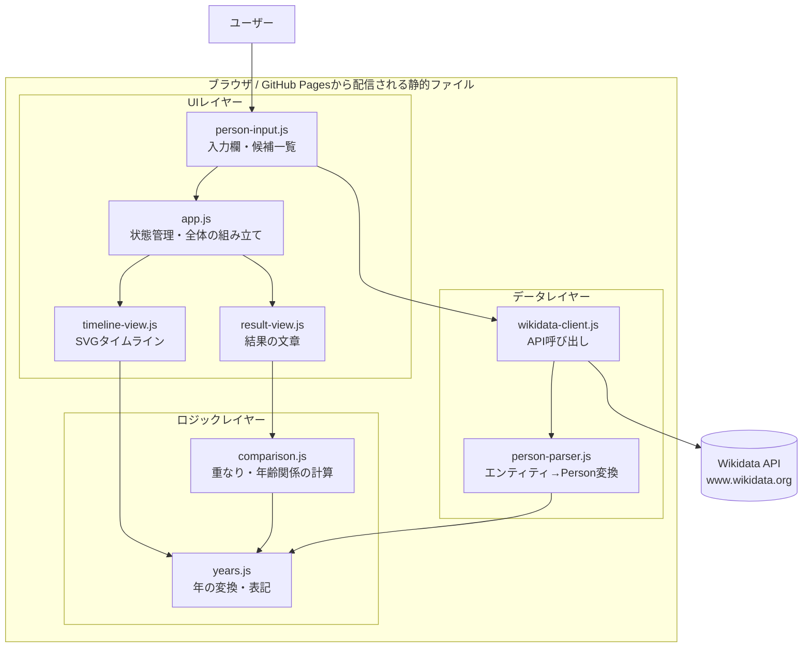
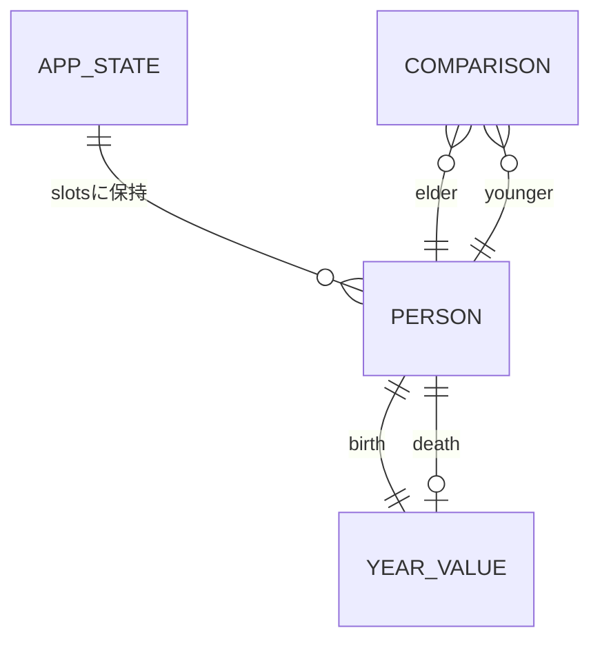
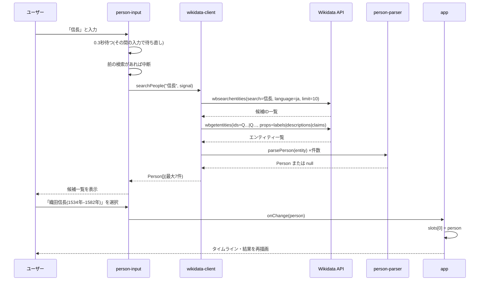
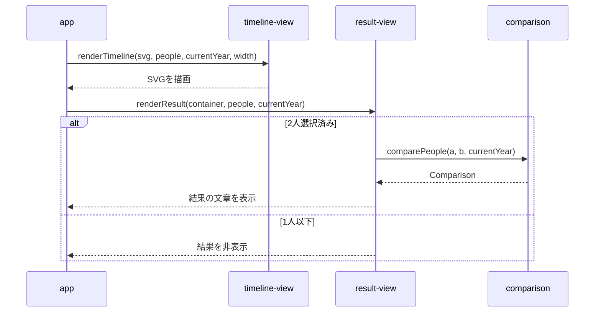
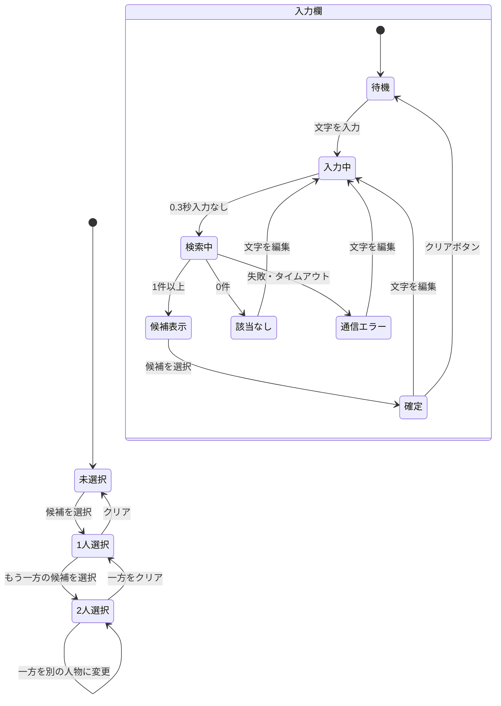

# 機能設計書 (Functional Design Document)

本書は `docs/product-requirements.md` のP0(MVP)機能を実現する方法を定義する。P1機能は、後から追加しやすい構造にするための考慮点のみ記載する。

## システム構成図

サーバーを持たない静的Webページとして構成し、ブラウザから直接Wikidata APIを呼び出す。



**レイヤーの依存方向**: UIレイヤー → ロジックレイヤー / データレイヤー。ロジックレイヤーとデータレイヤーはDOMに触れない。ロジックレイヤーは純粋関数のみで構成する(データレイヤーは通信を行うため純粋関数ではない)。

**図の矢印について**: `PersonInput --> App` は、`app.js` から渡されたコールバック(`onChange`)を呼ぶデータの流れを表す。`person-input.js` が `app.js` を `import` するわけではない(`import` の依存ルールは `docs/repository-structure.md` を参照)。

## 技術スタック

HTML / CSS / JavaScript(ES Modules)、描画はSVG、データはWikidata API、公開はGitHub Pages。フレームワーク・npmパッケージ・ビルドツールは使用しない。技術の詳細と選定理由は `docs/architecture.md` を正とする。

## データモデル定義

JavaScriptのため、型はJSDocの `@typedef` で定義する。

### YearValue(年の値)

```javascript
/**
 * @typedef {Object} YearValue
 * @property {number} year        歴史的な西暦年。紀元前は負数(前551年 = -551)。0は存在しない
 * @property {'year'|'decade'|'century'} precision  年の確かさ
 */
```

**制約**:
- `year` は0にならない(紀元前1年 = -1、紀元1年 = 1)
- Wikidataの精度(precision)との対応: `9`以上 → `'year'`、`8` → `'decade'`、`7`以下 → `'century'`
- `'decade'` のとき `year` は年代の先頭年(1530年代 → 1530)
- `'century'` のとき `year` はWikidataの値をそのまま保持し、世紀の算出は表記・描画時に行う

### Person(人物)

```javascript
/**
 * @typedef {Object} Person
 * @property {string} id               WikidataのID(例: "Q171411")
 * @property {string} label            表示名(日本語ラベル。なければ英語ラベル、それもなければID)
 * @property {string} description      短い説明(日本語。なければ空文字。英語の説明は子供には読みにくいため、labelと違い英語にはフォールバックしない)
 * @property {YearValue} birth         生年(必須。生年がない人物はPersonにならない)
 * @property {YearValue|null} death    没年(ない場合はnull)
 * @property {'deceased'|'living'|'unknown'} lifeStatus  没年の状態
 */
```

**lifeStatus の判定**:

| 条件 | lifeStatus |
|------|-----------|
| 没年(P570)に日付の値がある | `'deceased'` |
| 没年の値が「不明な値」(snaktype `somevalue`) | `'unknown'` |
| 没年がなく、生年が「現在の年 − 120」以降 | `'living'` |
| 上記以外(没年がなく、生年が120年より前) | `'unknown'` |

### Candidate(検索候補)

候補一覧の1行分。検索結果から得たPersonをそのまま使う(`Candidate = Person`)。候補一覧では `label(生年–没年)description` の形式で表示する。

### AppState(画面の状態)

```javascript
/**
 * @typedef {Object} AppState
 * @property {(Person|null)[]} slots  入力欄ごとの選択済み人物。MVPでは長さ2で固定
 */
```

**制約**:
- `slots` を配列にしておくことで、P1の3人以上の比較で要素数を増やすだけで済むようにする
- 状態はメモリ上にのみ保持し、保存しない

### Comparison(比較結果)

```javascript
/**
 * @typedef {Object} Comparison
 * @property {'overlap'|'gap'|'undetermined'} kind  重なりあり / 重なりなし / 判定不可
 * @property {number} [overlapStart]  重なり開始年(kind='overlap'のとき)
 * @property {number} [overlapEnd]    重なり終了年(kind='overlap'のとき)
 * @property {number} [overlapYears]  重なり年数(kind='overlap'のとき)
 * @property {Person} [elder]         先に生まれた人物
 * @property {Person} [younger]       後に生まれた人物
 * @property {number} [ageAtBirth]    youngerが生まれたときのelderの年齢(kind='overlap'のとき)
 * @property {number} [gapYears]      elderの没年からyoungerの生年までの年数(kind='gap'のとき)
 * @property {boolean} approximate    あいまいな年を含むかどうか
 */
```

### データの関係



## コンポーネント設計

### src/data/wikidata-client.js(データレイヤー)

**責務**:
- Wikidata APIへの問い合わせ(候補検索・詳細取得)
- タイムアウト(10秒)と中断の制御
- 取得したエンティティを `person-parser.js` でPersonに変換し、条件を満たす人物だけを返す

**インターフェース**:
```javascript
/**
 * 名前の一部から人物候補を検索する
 * @param {string} query  入力文字列(呼び出し側で前後の空白を除去し、100文字に切り詰め済み。1文字以上)
 * @param {AbortSignal} [signal]  前の検索を中断するためのシグナル
 * @returns {Promise<Person[]>}  最大7件。人間かつ生年を持つ人物のみ
 * @throws {WikidataError}  通信失敗・タイムアウト・不正な応答のとき
 */
export async function searchPeople(query, signal) {}
```

**依存関係**: `person-parser.js`、ブラウザの `fetch` / `AbortController`

### src/data/person-parser.js(データレイヤー)

**責務**:
- `wbgetentities` のエンティティ1件をPersonに変換する
- 人間(P31にQ5を含む)でない、または生年(P569)がないエンティティを除外する(`null` を返す)
- 削除済み・存在しない項目(エンティティに `missing` プロパティがある)も除外する(`null` を返す)
- 複数の値から使う値を選ぶ(下記アルゴリズム参照)

**インターフェース**:
```javascript
/**
 * @param {Object} entity  wbgetentitiesのentities[id]
 * @param {number} currentYear  存命判定に使う現在の年
 * @returns {Person|null}
 */
export function parsePerson(entity, currentYear) {}

/**
 * Wikidataの時刻文字列と精度をYearValueに変換する
 * @param {string} time  例: "+1534-06-23T00:00:00Z", "-0551-00-00T00:00:00Z"
 * @param {number} precision  Wikidataの精度(9=年, 8=年代, 7=世紀 など)
 * @returns {YearValue|null}  年が0など不正な場合はnull
 */
export function parseYearValue(time, precision) {}
```

**依存関係**: `years.js`

### src/logic/years.js(ロジックレイヤー)

**責務**:
- 歴史的な西暦年と、計算用の連続した数値(天文学的年)との相互変換
- 年・年代・世紀の日本語表記

**インターフェース**:
```javascript
/** 歴史的年 → 天文学的年(前1年 = 0、前551年 = -550) */
export function toAstronomical(year) {}

/** 天文学的年 → 歴史的年 */
export function fromAstronomical(astroYear) {}

/** 2つの歴史的年の差(年数)。0年がないことを考慮する */
export function yearsBetween(fromYear, toYear) {}

/** 年の表記。例: "1534年", "前551年", "1530年代", "6世紀頃", "前6世紀頃" */
export function formatYearValue(yearValue) {}

/** 目盛り用の短い表記。例: "1600", "前500" */
export function formatAxisYear(year) {}

/** 描画・計算に使う代表年(天文学的年)を返す */
export function representativeYear(yearValue) {}
```

**依存関係**: なし

### src/logic/comparison.js(ロジックレイヤー)

**責務**:
- 2人の生存期間から、重なり・年齢関係・空白期間を計算してComparisonを返す

**インターフェース**:
```javascript
/**
 * @param {Person} a
 * @param {Person} b
 * @param {number} currentYear  存命人物の終了年として使う
 * @returns {Comparison}
 */
export function comparePeople(a, b, currentYear) {}
```

**依存関係**: `years.js`

### src/ui/person-input.js(UIレイヤー)

**責務**:
- 入力欄1つ分の表示と操作(入力、候補一覧、キーボード操作、クリア)
- 入力の0.3秒デバウンスと、古い検索の中断
- 検索語の整形(前後の空白を除去し、100文字を超える部分を切り詰める)
- 検索中・0件・エラーの状態表示

**インターフェース**:
```javascript
/**
 * @param {HTMLElement} container  入力欄を描画する要素
 * @param {Object} options
 * @param {string} options.placeholder  例: "1人目の名前"
 * @param {(person: Person|null) => void} options.onChange  選択・クリア時に呼ばれる
 * @returns {{ setPerson: (person: Person|null) => void }}  P1のURL共有で外から値を設定するため
 */
export function createPersonInput(container, options) {}
```

**依存関係**: `wikidata-client.js`、`years.js`

### src/ui/timeline-view.js(UIレイヤー)

**責務**:
- 選択済みの人物(1人以上)からSVGのタイムラインを描画する
- 表示範囲・目盛り・線・ラベル・重なり区間・特殊ケースの端の表現

**インターフェース**:
```javascript
/**
 * @param {SVGSVGElement} svg
 * @param {Person[]} people  選択済みの人物(nullを除いたもの)
 * @param {number} currentYear
 * @param {number} width  描画幅(px)。コンテナの幅から算出
 */
export function renderTimeline(svg, people, currentYear, width) {}
```

**依存関係**: `years.js`

### src/ui/result-view.js(UIレイヤー)

**責務**:
- 2人が選択されたとき、Comparisonを結果の文章にして表示する
- 1人以下のときは非表示にする

**インターフェース**:
```javascript
/**
 * @param {HTMLElement} container
 * @param {Person[]} people
 * @param {number} currentYear
 */
export function renderResult(container, people, currentYear) {}
```

**依存関係**: `comparison.js`、`years.js`

### src/app.js(UIレイヤー)

**責務**:
- AppStateの保持と更新
- 入力欄の生成、状態が変わったときのタイムライン・結果の再描画
- 画面幅の変化(`resize`)に応じた再描画

**依存関係**: `person-input.js`、`timeline-view.js`、`result-view.js`

## ユースケース図

### UC1: 人物を検索して選択する



**フロー説明**:
1. 入力が止まってから0.3秒後に検索を開始する。入力が空(空白のみ)なら検索せず候補一覧を閉じる
2. 新しい検索を始めるとき、実行中の古い検索は `AbortController` で中断する。古い応答が後から届いて候補を上書きすることを防ぐ
3. `wbsearchentities` で最大10件のIDを取得し、`wbgetentities` で詳細を1回でまとめて取得する
4. 人間でない・生年がないエンティティを除外し、検索結果の順番を保ったまま最大7件を表示する
5. 候補を選ぶと入力欄に人物名が確定し、`onChange` で状態が更新される

### UC2: 2人を比較する



**フロー説明**:
1. 状態が変わるたびに、タイムラインと結果の両方を描き直す(差分更新はしない。人数が少ないため十分速い)
2. 1人だけ選択されている場合も、その人物の線を描く
3. 0人のときは、タイムライン領域に「名前を入力して、比べたい人物を選んでください」と表示する

## 画面遷移図

1ページ構成のため、画面遷移はない。画面の状態の変化を示す。



## API設計

自前のAPIは持たない。利用するWikidata APIを定義する。エンドポイントはいずれも `https://www.wikidata.org/w/api.php`。

### 候補検索: wbsearchentities

```
GET https://www.wikidata.org/w/api.php
  ?action=wbsearchentities
  &search={入力文字列}
  &language=ja
  &uselang=ja
  &type=item
  &limit=10
  &format=json
  &origin=*
```

**レスポンス(必要な部分)**:
```json
{
  "search": [
    { "id": "Q171411", "label": "織田信長", "description": "日本の戦国大名" }
  ]
}
```

### 詳細取得: wbgetentities

```
GET https://www.wikidata.org/w/api.php
  ?action=wbgetentities
  &ids={ID1}|{ID2}|...
  &props=labels|descriptions|claims
  &languages=ja|en        # enは日本語ラベルがない人物の英語ラベル取得のため
  &format=json
  &origin=*
```

**レスポンス(必要な部分)**:
```json
{
  "entities": {
    "Q171411": {
      "id": "Q171411",
      "labels": { "ja": { "value": "織田信長" } },
      "descriptions": { "ja": { "value": "日本の戦国大名" } },
      "claims": {
        "P31": [ { "mainsnak": { "datavalue": { "value": { "id": "Q5" } } }, "rank": "normal" } ],
        "P569": [ {
          "mainsnak": {
            "snaktype": "value",
            "datavalue": { "value": { "time": "+1534-06-23T00:00:00Z", "precision": 11 } }
          },
          "rank": "normal"
        } ],
        "P570": [ { "mainsnak": { "snaktype": "value", "datavalue": { "value": { "time": "+1582-06-21T00:00:00Z", "precision": 11 } } }, "rank": "normal" } ]
      }
    }
  }
}
```

**エラー時の扱い**:
- HTTPステータスが200以外 → 通信エラー
- レスポンスに `error` プロパティがある → 通信エラー
- 10秒以内に応答がない → タイムアウト(通信エラーと同じ表示)
- `wbsearchentities` の結果が0件 → 詳細取得を行わず「該当なし」
- `wbgetentities` の一部のエンティティに `missing` がある → そのエンティティだけを候補から除外する(エラーにしない)

## アルゴリズム設計

### A1: 使う値の選択(生年・没年)

**目的**: 生年月日(P569)・没年月日(P570)に複数の値があるとき、1つを選ぶ

1. ランクが `deprecated` の値を除外する
2. `preferred` ランクの値があれば、その中の先頭を使う
3. なければ残りのうち、Wikidataの応答の配列で先頭にある値を使う
4. 選んだ値の `snaktype` が `value` 以外の場合:
   - 生年 → 生年データなしとして人物を除外する
   - 没年が `somevalue`(不明な値)→ lifeStatus を `'unknown'` にする
   - 没年が `novalue` → 没年データなしとして扱う(存命判定へ)

### A2: 年の読み取り

**目的**: `+1534-06-23T00:00:00Z` 形式の文字列から年を取り出す

- 正規表現 `^([+-])(\d+)-` で符号と年を取り出す
- `-` のとき負数にする(`-0551` → `-551` = 前551年)
- 年が0になる場合は不正な値として `null` を返す(その人物は生年データなしとして除外、没年なら没年データなしとして扱う)
- 精度から `precision` を決める(9以上 → `'year'`、8 → `'decade'`、7以下 → `'century'`)
- `'decade'` のときは10の倍数に切り下げる(1534 → 1530)

### A3: 年の変換と年数の計算

**目的**: 西暦に0年がないことを考慮して、紀元前と紀元後をまたぐ年数を正しく計算する

**天文学的年への変換**:
```javascript
export function toAstronomical(year) {
  return year < 0 ? year + 1 : year;   // 前1年 → 0、前551年 → -550
}

export function fromAstronomical(astroYear) {
  return astroYear <= 0 ? astroYear - 1 : astroYear;
}

export function yearsBetween(fromYear, toYear) {
  return toAstronomical(toYear) - toAstronomical(fromYear);
}
```

**例**:
- `yearsBetween(1543, 1582)` = 39
- `yearsBetween(-4, 30)` = 30 − (−3) = 33

**代表年(描画・計算用、天文学的年で返す)**:

| precision | 代表年 | 例 |
|-----------|--------|-----|
| `'year'` | その年 | 1534 → 1534 |
| `'decade'` | 年代の中央(先頭年 + 5) | 1530年代 → 1535 |
| `'century'` | 世紀の中央 | 6世紀 → 550、前6世紀 → -549(前550年) |

**世紀の算出**(Wikidataの表示と同じ規則):
- 紀元後: `century = Math.floor((year - 1) / 100) + 1`(600 → 6世紀、501 → 6世紀)
- 紀元前: `century = Math.floor((-year - 1) / 100) + 1`(-551 → 前6世紀)
- 紀元後の世紀の中央: `(century - 1) * 100 + 50`
- 紀元前の世紀の中央: 歴史的年 `-((century - 1) * 100 + 50)` を天文学的年に変換

### A4: 年の表記

| 条件 | 表記 | 例 |
|------|------|-----|
| year, 紀元後 | `{year}年` | 1534年 |
| year, 紀元前 | `前{-year}年` | 前551年 |
| decade, 紀元後 | `{year}年代` | 1530年代 |
| decade, 紀元前 | `前{-year}年代` | 前550年代 |
| century, 紀元後 | `{century}世紀頃` | 6世紀頃 |
| century, 紀元前 | `前{century}世紀頃` | 前6世紀頃 |

候補一覧の生没年は、あいまいな年も上記の表記を使う。存命は `(1960年–)`、没年不明は `(1100年–?)` のように表示する。
例: `孔子(前551年–前479年)`、`雪舟(1420年–1506年)`

### A5: 2人の比較

**目的**: Comparisonを算出する

**ステップ1: 判定不可の確認**
- どちらかの lifeStatus が `'unknown'` → `kind: 'undetermined'` を返す

**ステップ2: 終了年の決定(天文学的年)**
- `'deceased'` → 没年の代表年
- `'living'` → `currentYear`

**ステップ3: 先に生まれた人物の決定**
- 生年の代表年が小さいほうを `elder`、大きいほうを `younger` とする
- 同じ場合は入力欄の順(1人目を `elder`)

**ステップ4: 重なりの計算**
```javascript
const overlapStart = youngerBirth;               // 天文学的年
const overlapEnd = Math.min(elderEnd, youngerEnd);

if (overlapStart <= overlapEnd) {
  // 重なりあり
  overlapYears = overlapEnd - overlapStart;
  ageAtBirth = youngerBirth - elderBirth;
} else {
  // 重なりなし
  gapYears = youngerBirth - elderEnd;
}
```

**ステップ5: あいまいさの判定**
- 2人の生年・没年のうち1つでも precision が `'year'` 以外なら `approximate: true`

**結果の文章**:

| 条件 | 文章 |
|------|------|
| 重なりあり | `{開始年}〜{終了年}の約{overlapYears}年間、同じ時代を生きていました` |
| 重なりあり、overlapYears = 0 | `{開始年}の1年足らずの間、同じ時代を生きていました` |
| 重なりあり、ageAtBirth ≥ 1 | 続けて `{younger}が生まれたとき、{elder}は約{ageAtBirth}歳でした` |
| 重なりあり、ageAtBirth = 0 | 続けて `2人は同じ年に生まれました` |
| 重なりあり、youngerが存命かつelderも存命 | 終了年の部分を `{開始年}から現在までの約{overlapYears}年間、同じ時代を生きています` にする |
| 重なりなし | `{elder}が亡くなってから約{gapYears}年後に、{younger}が生まれました` |
| 重なりなし、gapYears = 0 | `{elder}が亡くなった年に、{younger}が生まれました` |
| 判定不可 | `{没年不明の人物}の没年が不明なため、同じ時代かどうかを判定できません` |
| approximate = true | 最後に `※生没年があいまいな人物を含むため、目安です` を添える |

年は A4 の表記(紀元前は「前○年」)で表示する。存命の場合の「現在」は `currentYear`(閲覧時の年)。

**例**: 織田信長(1534–1582)と徳川家康(1543–1616)
- overlapStart = 1543、overlapEnd = min(1582, 1616) = 1582
- overlapYears = 39、ageAtBirth = 9
- → 「1543年〜1582年の約39年間、同じ時代を生きていました」「徳川家康が生まれたとき、織田信長は約9歳でした」

### A6: タイムラインの表示範囲と目盛り

**目的**: 選択済みの人物がすべて収まり、目盛りが読みやすい範囲を決める

**ステップ1: データの範囲**(天文学的年)
- `minYear` = 全員の生年の代表年の最小値
- `maxYear` = 全員の終了年の最大値(存命は `currentYear`、没年不明は `生年 + 50` を仮の描画終了年とする)

**ステップ2: 余白**
- `span = maxYear - minYear`
- `padding = Math.max(5, Math.round(span * 0.1))`
- 表示範囲は `[minYear - padding, maxYear + padding]`

**ステップ3: 目盛り間隔**
- 候補 `[1, 2, 5, 10, 20, 25, 50, 100, 200, 250, 500, 1000]` のうち、表示範囲内の目盛りが最大8本になる最小の間隔を選ぶ
- 最大の候補(1000)でも8本を超える場合は1000を使い、8本を超えることを許容する
- 目盛りは天文学的年が間隔の倍数になる位置に置き、ラベルは `formatAxisYear` で歴史的年に変換して表示する

**ステップ4: 座標変換**
- `x = marginLeft + (astroYear - rangeStart) / (rangeEnd - rangeStart) * plotWidth`

## UI設計

### 画面レイアウト

```
┌────────────────────────────────────────────┐
│ 偉人の時代                                   │
│ 2人の偉人が同じ時代を生きていたかを調べよう     │
├────────────────────────────────────────────┤
│ [● 1人目の名前          ×]                  │
│ [● 2人目の名前          ×]                  │  ← PCでは横並び、スマホでは縦並び
├────────────────────────────────────────────┤
│         織田信長                             │
│    1534 ━━━━━━━━━━━━━━━━ 1582                │
│             ░░░░░░░░░░░░░                   │  ← 重なり区間の背景
│            徳川家康  ░░░                     │
│         1543 ━━━━━━━━━━━━━━━━━━━━━━ 1616     │
│  |1520   |1540   |1560   |1580   |1600     │
├────────────────────────────────────────────┤
│ 1543年〜1582年の約39年間、                   │
│ 同じ時代を生きていました                      │
│ 徳川家康が生まれたとき、織田信長は約9歳でした   │
├────────────────────────────────────────────┤
│ データ出典: Wikidata                         │
└────────────────────────────────────────────┘
```

- 入力欄の左の丸(●)は、その人物の線の色を示す
- 画面幅600px未満では入力欄を縦に並べる

### 候補一覧

| 項目 | 説明 | フォーマット |
|------|------|-------------|
| 名前 | Personのlabel | 太字 |
| 生没年 | 生年–没年 | `(1534年–1582年)`、存命は `(1960年–)`、没年不明は `(1100年–?)` |
| 説明 | Personのdescription | 小さめの灰色文字。空なら省略 |

**操作**:
- 上下キーで選択移動、Enterで確定、Escで一覧を閉じる
- 検索中は一覧の位置に「検索中…」を表示する
- 候補の各行は高さ44px以上

**アクセシビリティ**(PRDの非機能要件「キーボード操作」「スクリーンリーダー」に対応):
- 入力欄と候補一覧はWAI-ARIAのcomboboxパターン(`role="combobox"`、`role="listbox"`、`role="option"`、`aria-activedescendant`)に従う
- 候補の件数・「該当する人物が見つかりませんでした」・通信エラーのメッセージは `aria-live="polite"` の領域に表示し、読み上げさせる
- 比較結果の文章の領域は `aria-live="polite"` とし、結果が変わったら読み上げさせる
- タイムラインのSVGは `role="img"` とし、`aria-label` に「織田信長 1534年〜1582年、徳川家康 1543年〜1616年のタイムライン」のような要約を設定する
- クリアボタンは `<button>` 要素で作り、`aria-label="1人目をクリア"` のように対象がわかるラベルを付ける

### タイムラインの描画要素

| 要素 | 描画 |
|------|------|
| 人物の線 | 太さ6pxの横線。1人目は上段、2人目は下段 |
| 人物名 | 線の上、線の左端に揃える |
| 生年・没年 | 線の左端の左/右端の右に表示。文字の幅(`getComputedTextLength()` で計測)+4pxが、線の端から描画領域の端までの余白より大きい場合は、線の下に端を揃えて表示 |
| 重なり区間 | 重なる期間の全高に半透明の背景色(黄色系)を塗る |
| 目盛り | 下部に目盛り線とラベル。縦の補助線を薄い灰色で引く |
| 存命 | 線の右端(現在の年)を矢印の形にする。没年の位置に「存命」と表示 |
| あいまいな年 | その端から線の長さの10%(最低20px)の区間を点線にする |
| 没年不明 | 生年から仮の描画終了年までを点線で描き、右端に「没年不明」と表示 |

**複数の表現が重なる場合**: 没年不明の人物は線全体が点線になるため、あいまいな年の端の点線は重ねて適用しない(生年があいまいな場合は、生年の表記「6世紀頃」だけで表す)。存命の矢印とあいまいな生年の点線は、両端で別々に適用する。

### カラーコーディング

色覚の多様性に配慮し、Okabe-Itoパレットから選ぶ。人物名のラベルを必ず併記し、色だけに頼らない。

- 1人目: 青 `#0072B2`
- 2人目: オレンジ `#E69F00`
- (P1の3人目以降の予備: 緑 `#009E73`、赤紫 `#CC79A7`)
- 重なり区間: 黄 `#F0E442`(不透明度0.35)
- 目盛り・補助線: 灰 `#999999`

## ファイル構造

データの保存は行わない。配信するファイルの構成は `docs/repository-structure.md` で定義する。

## P1機能への備え

| P1機能 | 本設計での備え |
|--------|--------------|
| URLでの共有 | `createPersonInput` が `setPerson` を返すので、URLのIDから取得したPersonを外から設定できる。IDからの取得は `wbgetentities` のみで実現できる |
| 3人以上の比較 | `AppState.slots` を配列にし、`renderTimeline` は人数に依存しない作りにする。結果の文章は、人数に応じた表現を後で追加する |
| 人物の詳細表示 | Personに `id` を持たせているので、Wikipediaへのリンクを後から生成できる |

## パフォーマンス最適化

- **デバウンス**: 入力が止まってから0.3秒後にのみ検索し、1文字ごとの問い合わせをしない
- **古い検索の中断**: 新しい検索の開始時に古いリクエストを `AbortController` で中断する
- **一括取得**: 候補の詳細は `wbgetentities` 1回でまとめて取得する(1検索あたり合計2リクエスト)
- **同じ入力の再検索を省略**: 直前と同じ入力文字列では再検索しない
- **再描画の間引き**: `resize` 時の再描画は `requestAnimationFrame` で1フレームに1回までにする

## セキュリティ考慮事項

- **外部データの表示**: Wikidataの文字列は `textContent` / SVGの `textContent` で設定し、`innerHTML` を使わない
- **URLの組み立て**: 検索語は `URLSearchParams` でエンコードする
- **個人情報**: 入力内容をどこにも保存・送信しない(Wikidataへの検索語の送信を除く)
- **通信**: Wikidata APIへHTTPSでのみ接続する

## エラーハンドリング

### エラーの分類

| エラー種別 | 処理 | ユーザーへの表示 |
|-----------|------|-----------------|
| 候補0件(検索結果なし、または条件に合う人物なし) | 候補一覧に表示 | 「該当する人物が見つかりませんでした」 |
| 通信失敗(ネットワーク、HTTPエラー、APIの`error`) | 候補一覧に表示。選択済みの人物とタイムラインはそのまま保つ | 「データを取得できませんでした。時間をおいて試してください」 |
| タイムアウト(10秒) | 通信失敗と同じ | 同上 |
| 検索の中断(新しい入力による) | 何もしない(エラーとして扱わない) | なし |
| 生年の値が不正(年が0など) | その人物を候補から除外 | なし |
| 没年の値が不正 | 没年データなしとして扱う | 存命または「没年不明」 |

再試行は、利用者が文字を編集したときに自動で行われる(専用の再試行ボタンは設けない)。

## テスト戦略

テストの実行方法(ツール)は `docs/architecture.md` で定義する。

### ユニットテスト(DOMを使わない関数)

この一覧をユニットテストの対象ケースの正とする(`docs/development-guidelines.md` から参照される)。

- `years.js`: 天文学的年の変換、`yearsBetween`(紀元前をまたぐケース)、表記(年・年代・世紀、紀元前・紀元後)、代表年
- `person-parser.js`: 年の読み取り(紀元前、精度、0年)、ランクによる値の選択、`somevalue` / `novalue`、存命判定、ラベルのフォールバック、人間でない・生年なし・`missing` の除外
- `comparison.js`: 重なりあり・なし・判定不可、同年生まれ、重なり0年、存命人物を含む比較、あいまいな年を含む比較、紀元前の人物同士の比較

### 手動テスト(ブラウザでの動作確認)
- PRDの受け入れ条件に沿ったチェックリストで確認する
- PRDのKPIにある検証用20人の生没年表示が、Wikidataの値と一致すること(20人の条件はPRDの成功指標を参照)
- iPhone(Safari)、Android(Chrome)、PC(Chrome / Edge / Safari / Firefox)での表示と操作
- 通信エラー(ブラウザの開発者ツールでオフラインにする)時の表示
